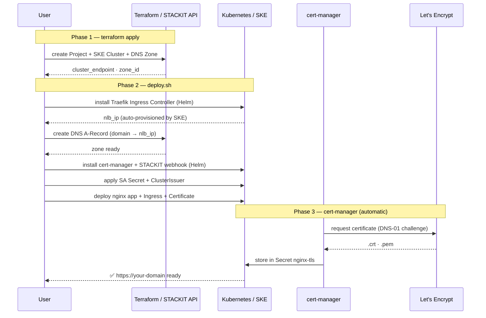

# SKE TLS Showcase — NLB + Traefik + cert-manager

Deploys a STACKIT SKE cluster with a Traefik Ingress Controller behind an auto-provisioned NLB.
TLS is handled in-cluster by cert-manager (Let's Encrypt DNS-01 via STACKIT webhook) — no ALB involved.
Serves as a conceptual baseline for the upcoming STACKIT ALB integration on Kubernetes.

---

## Architecture



```
Client → STACKIT DNS → STACKIT NLB (auto) → Traefik Ingress Controller → nginx Pod
                                              └── TLS: cert-manager + Let's Encrypt
```

---

## Overview

| Component              | Description                                                              |
| ---------------------- | ------------------------------------------------------------------------ |
| Resource hierarchy     | Project under an existing STACKIT organisation                           |
| Kubernetes             | STACKIT Kubernetes Engine (SKE) cluster                                  |
| Network                | NLB auto-provisioned by SKE when Traefik LoadBalancer Service is created |
| Ingress                | Traefik Ingress Controller (Helm)                                        |
| Certificate automation | cert-manager + STACKIT DNS-01 webhook (Helm)                             |
| DNS                    | STACKIT primary zone + A-record pointing to the NLB IP                   |
| Application            | nginx Deployment + Service + Ingress + Certificate manifest              |

| In this showcase                    | Not in this showcase                               |
| ----------------------------------- | -------------------------------------------------- |
| cert-manager + Let's Encrypt DNS-01 | STACKIT ALB Ingress Controller (not yet available) |
| SKE cluster via Terraform           | Self-signed or manually managed certs              |
| Traefik Ingress Controller          | ALB direct Kubernetes integration                  |
| STACKIT DNS-01 webhook              | Multiple namespaces / production Helm values       |

---

## Prerequisites

| Tool        | Version |
| ----------- | ------- |
| Terraform   | >= 1.3  |
| helm        | >= 3.x  |
| kubectl     | >= 1.28 |
| STACKIT CLI | >= 0.64 |
| jq          | any     |

### Required STACKIT permissions

| Service Account | Permissions                            | Used by                           |
| --------------- | -------------------------------------- | --------------------------------- |
| Terraform SA    | SKE Admin, DNS Admin, Resource Manager | `terraform apply`                 |
| DNS SA          | DNS Admin (project-scoped)             | DNS-01 challenge via cert-manager |

Place the DNS SA key at `terraform/keys/sa-key.json`. `deploy.sh` creates the Kubernetes Secret from this file automatically.

### Create service accounts

```bash
# Terraform SA
stackit iam service-account create \
  --project-id <project-id> \
  --name "tf-workshop-sa"

mkdir -p terraform/keys
stackit iam service-account key create \
  --project-id <project-id> \
  --service-account-email <sa-email> \
  --output-format json > terraform/keys/sa-key.json

# DNS SA (for cert-manager webhook)
stackit iam service-account create \
  --project-id <project-id> \
  --name "dns-certmanager-sa"

stackit iam service-account key create \
  --project-id <project-id> \
  --service-account-email <dns-sa-email> \
  --output-format json > terraform/keys/sa-key.json
```

---

## Deployment

### 1. Configure credentials

```bash
cd terraform
cp backend.conf.example backend.conf         # fill in access_key + secret_key
cp terraform.tfvars.example terraform.tfvars # fill in all values
```

### 2. Provision infrastructure

```bash
terraform init -backend-config=backend.conf
terraform plan
terraform apply
```

### 3. Set kubeconfig

```bash
export KUBECONFIG=$(pwd)/../.kubeconfig
kubectl get nodes
```

### 4. Deploy cluster components

`deploy.sh` sets the DNS A record, installs Helm charts, and applies manifests.
The DNS SA key must exist at `terraform/keys/sa-key.json` (DNS Admin role required).

```bash
cd .. && bash scripts/deploy.sh
```

---

## Validation

```bash
# Monitor certificate issuance
kubectl describe certificate nginx-tls -n nginx-showcase

# Test HTTPS once the certificate is Ready
curl https://<app_hostname>.<dns_zone_fqdn>

# Verify NLB IP is wired to DNS
dig <app_hostname>.<dns_zone_fqdn>
```

---

## TLS Flow (DNS-01)

1. cert-manager creates an ACME order with Let's Encrypt
2. Let's Encrypt requests a `_acme-challenge` TXT record
3. STACKIT webhook creates the TXT record via the STACKIT DNS API
4. Let's Encrypt validates and issues the certificate
5. cert-manager stores the certificate in Secret `nginx-tls`
6. Traefik reads the secret and terminates TLS
7. cert-manager auto-renews 30 days before expiry

---

## File Structure

```
alb-k8s/
├── terraform/
│   ├── 00-backend.tf              # S3 backend declaration
│   ├── 00-provider.tf             # Provider versions + STACKIT provider config
│   ├── 01-variables.tf
│   ├── 02-resource-hierarchy.tf   # Creates STACKIT folder + project
│   ├── 03-network.tf              # NLB is auto-provisioned by SKE (no explicit resources)
│   ├── 04-compute.tf              # SKE cluster + kubeconfig
│   ├── 05-dns.tf                  # DNS zone (A record set by deploy.sh)
│   ├── 06-outputs.tf
│   ├── backend.conf               # Backend credentials (gitignored)
│   ├── backend.conf.example
│   ├── terraform.tfvars           # Active config (gitignored)
│   └── terraform.tfvars.example
├── kubernetes/
│   ├── cert-manager/
│   │   ├── 00-stackit-sa-secret.yaml   # SA secret template (deploy.sh creates from keys/)
│   │   ├── 01-cluster-issuer.yaml      # ClusterIssuer: Let's Encrypt production
│   │   └── 02-certificate.yaml
│   └── nginx/
│       ├── 00-namespace.yaml
│       ├── 01-deployment.yaml
│       ├── 02-service.yaml
│       └── 03-ingress.yaml
├── docs/
│   └── architecture.md         # Deployment sequence diagram + component overview
├── scripts/
│   └── deploy.sh
└── terraform/keys/             # SA key JSON files — gitignored
```

---

## Security

| File                         | Git status | Contains                   |
| ---------------------------- | ---------- | -------------------------- |
| `terraform/terraform.tfvars` | gitignored | Sensitive configuration    |
| `terraform/backend.conf`     | gitignored | Object Storage access keys |
| `terraform/keys/`            | gitignored | Service account JSON keys  |

- SSH access is not directly exposed — cluster access via kubeconfig only
- Never commit SA key JSON files to the repository
- The DNS SA key is the most sensitive credential — it has write access to your DNS zone

---

## Cleanup

```bash
cd terraform && terraform destroy
```

> **Note:** After `terraform destroy`, STACKIT projects remain in "Pending Deletion" for up to 7 days. This is expected STACKIT platform behaviour.

---

## Troubleshooting

**Certificate stuck in Pending:**

```bash
kubectl describe certificate nginx-tls -n nginx-showcase
kubectl describe certificaterequest -n nginx-showcase
kubectl logs -n cert-manager deploy/cert-manager
kubectl logs -n cert-manager -l app=stackit-cert-manager-webhook
```

Common causes: wrong `projectId` in ClusterIssuer, SA missing DNS permissions, DNS zone in wrong project.

**Traefik has no external IP:**

```bash
kubectl get svc -n traefik traefik
```

Wait 2–3 minutes — STACKIT provisions the NLB asynchronously.

**kubeconfig expired:**

```bash
cd terraform && terraform apply
export KUBECONFIG=$(pwd)/../.kubeconfig
```

---

## References

- [Full architecture details](docs/architecture.md)
- [STACKIT Terraform Provider](https://registry.terraform.io/providers/stackitcloud/stackit/latest/docs)
- [STACKIT CLI](https://github.com/stackitcloud/stackit-cli)
- [STACKIT Developer Documentation](https://docs.stackit.cloud)
- [cert-manager](https://cert-manager.io/docs/)
- [stackit-cert-manager-webhook](https://github.com/stackitcloud/stackit-cert-manager-webhook)
