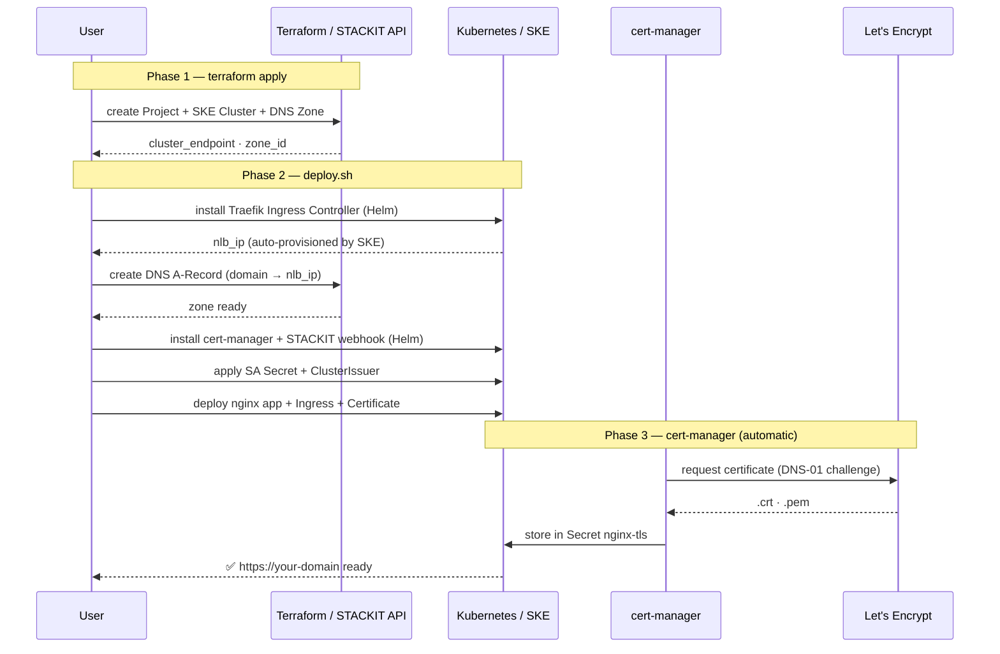

# Architecture: alb-k8s

## Deployment Sequence



---

# SKE with TLS — NLB + Traefik + cert-manager

## Traffic Flow

```
  Client
    │
    │ DNS lookup: nginx.alb-k8s-showcase.stackit.gg
    ▼
  STACKIT DNS
    │ resolves to NLB public IP (set by deploy.sh)
    │
    │ HTTPS :443
    ▼
  STACKIT NLB  (L4, provisioned automatically by SKE)
    │
    │ TCP passthrough
    ▼
  Traefik Ingress Controller  (L7, in-cluster)
    │ TLS termination (cert from Secret: nginx-tls)
    │ Host-based routing + HTTP→HTTPS redirect
    ▼
  ClusterIP Service: nginx  (namespace: nginx-showcase)
    │
    ▼
  Pod: nginxinc/nginx-unprivileged:1.27-alpine
```

**NLB provisioning:** STACKIT creates the NLB automatically when the Traefik
`Service` of type `LoadBalancer` is applied. The assigned IP is dynamic; `deploy.sh`
reads it and creates the DNS A record via the STACKIT CLI.

---

## TLS Certificate Flow (DNS-01)

```
  cert-manager          stackit-cert-manager-webhook   STACKIT DNS API   Let's Encrypt
       │                            │                        │                 │
       │── new Certificate ────────►│                        │                 │
       │                            │                        │                 │
       │◄── ACME order ────────────────────────────────────────────────────────│
       │                            │                        │                 │
       │── solve DNS-01 ───────────►│                        │                 │
       │                            │── create TXT record ──►│                 │
       │                            │   _acme-challenge.nginx │                 │
       │                            │   .alb-k8s-showcase     │                 │
       │                            │   .stackit.gg           │                 │
       │                            │                        │                 │
       │◄── challenge ready ──────────────────────────────────────────────────│
       │                            │◄── verify TXT ─────────│                 │
       │                            │                        │                 │
       │◄── certificate issued ────────────────────────────────────────────────│
       │                            │                        │                 │
       │── delete TXT record ──────►│── delete TXT ─────────►│                 │
       │                            │                        │                 │
       │── store in Secret: nginx-tls (namespace: nginx-showcase)
```

cert-manager renews automatically 30 days before expiry.

---

## Component Responsibility

| Component                  | Provisioned by                         | Purpose                                            |
| -------------------------- | -------------------------------------- | -------------------------------------------------- |
| STACKIT Folder + Project   | Terraform (`02-resource-hierarchy.tf`) | Resource boundary                                  |
| SKE Cluster                | Terraform (`04-compute.tf`)            | Kubernetes control plane + nodes                   |
| DNS Zone                   | Terraform (`05-dns.tf`)                | `alb-k8s-showcase.stackit.gg`                      |
| DNS A Record               | `deploy.sh` (stackit CLI)              | `nginx.alb-k8s-showcase.stackit.gg → NLB IP`       |
| STACKIT NLB                | STACKIT (automatic on LB Service)      | L4 load balancer                                   |
| Traefik Ingress Controller | Helm (`deploy.sh`)                     | L7 routing + TLS termination + HTTP→HTTPS redirect |
| cert-manager               | Helm (`deploy.sh`)                     | Certificate lifecycle                              |
| STACKIT DNS webhook        | Helm (`deploy.sh`)                     | DNS-01 solver                                      |
| SA Secret                  | `deploy.sh` (kubectl)                  | Webhook authenticates against STACKIT API          |
| nginx Pod                  | kubectl (`deploy.sh`)                  | Demo workload                                      |

---

## Namespace Layout

```
traefik
  └── Deployment: traefik                    (Traefik IC)
  └── Service: traefik                       (LoadBalancer → NLB)

cert-manager
  └── Deployment: cert-manager
  └── Deployment: cert-manager-webhook
  └── Deployment: stackit-cert-manager-webhook
  └── Secret: stackit-sa-authentication      (STACKIT SA key)
  └── ClusterIssuer: letsencrypt-prod

nginx-showcase
  └── Deployment: nginx
  └── Service: nginx                         (ClusterIP)
  └── Certificate: nginx-tls
  └── Secret: nginx-tls                      (managed by cert-manager)
  └── Ingress: nginx
```

---
