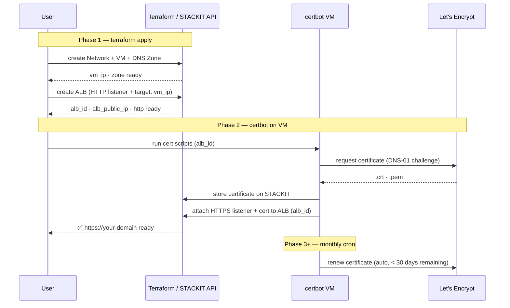

# STACKIT ALB + Let's Encrypt Workshop

Infrastructure-as-Code workshop environment demonstrating automated TLS certificate lifecycle on STACKIT — Terraform provisions the ALB with an HTTP listener, certbot issues a Let's Encrypt certificate via ACME DNS-01 and attaches it as an HTTPS listener to the ALB.

---

## Overview

This repository provisions a fully reproducible demo environment on STACKIT using Terraform. It covers the complete path from infrastructure provisioning to automated certificate management.

| Component              | Description                                                                                                         |
| ---------------------- | ------------------------------------------------------------------------------------------------------------------- |
| Resource hierarchy     | Folder and project under an existing STACKIT organisation                                                           |
| Network                | Private routed network (`10.10.0.0/24`) with security groups                                                        |
| Compute                | Debian 12 VM with Docker Engine (provisioned via cloud-init)                                                        |
| DNS                    | Primary zone for ACME DNS-01 challenge validation                                                                   |
| Load Balancer          | Application Load Balancer with HTTP and HTTPS listeners                                                             |
| Certificate automation | [vm-alb-certbot-letsencrypt](vm-alb-certbot-letsencrypt/readme.md) — PowerShell/certbot container running on the VM |

---

## Architecture



```
STACKIT Organisation
└── Folder: alb-certbot-workshop
    └── Project: alb-certbot-dev
        ├── Network: alb-certbot-net (10.10.0.0/24, routed)
        │   └── Security Group: alb-certbot-docker-host-sg
        │       ├── Ingress TCP 22  ← admin_cidr only
        │       ├── Ingress TCP 80  ← 0.0.0.0/0  (ALB backend traffic)
        │       ├── Ingress TCP 443 ← 0.0.0.0/0
        │       └── Egress all      → 0.0.0.0/0
        ├── VM: alb-certbot-docker-host (Debian 12)
        │   ├── Public IP
        │   └── Docker Engine + nginx:alpine (health-check backend)
        ├── DNS Zone: alb-workshop.stackit.gg (primary)
        └── ALB: alb-certbot-workshop
            ├── Public IP (dedicated, wired to DNS A-record by Terraform)
            ├── Listener HTTP  :80  → VM:80
            └── Listener HTTPS :443 → VM:80  (TLS terminated at ALB)
```

The ALB terminates TLS — the backend VM only receives plain HTTP on port 80. This is standard practice: one TLS endpoint, no certificate management on individual backend hosts.

### Certificate lifecycle

```
Phase 1 — terraform apply
  ALB provisioned with HTTP listener + target pool (VM private IP).
  DNS A-record for the zone apex is created pointing to the ALB public IP.

Phase 2 — certbot (Docker container, runs on the VM)
  Runs certbot DNS-01: writes _acme-challenge TXT record via STACKIT DNS API
  Let's Encrypt validates the challenge and issues the certificate
  Uploads the certificate to STACKIT Certificate Manager
  Patches the ALB — adds HTTPS listener with the new certificate ID via API

Phase 3+ — monthly cron job on the VM
  Checks remaining certificate validity; renews automatically when < 30 days remain
```

> `lifecycle.ignore_changes = [listeners]` is set on the ALB resource so that `terraform apply` does not revert certificate updates made by vm-alb-certbot-letsencrypt.

---

## Prerequisites

### Required tools

| Tool                                                           | Version  | Notes                                              |
| -------------------------------------------------------------- | -------- | -------------------------------------------------- |
| [Terraform](https://developer.hashicorp.com/terraform/install) | >= 1.5.0 | Infrastructure provisioning                        |
| [STACKIT CLI](https://github.com/stackitcloud/stackit-cli)     | latest   | Image/machine-type lookups, role assignment        |
| SSH client                                                     | —        | VM access                                          |
| Docker                                                         | —        | Build and run vm-alb-certbot-letsencrypt on the VM |

### STACKIT service account permissions

| Scope        | Role                             | Purpose                      |
| ------------ | -------------------------------- | ---------------------------- |
| Organisation | `resourcemanager.folders.admin`  | Create folder                |
| Folder       | `resourcemanager.projects.admin` | Create project               |
| Project      | `compute.admin`                  | VM, network, security groups |
| Project      | `dns.admin`                      | DNS zone and records         |
| Project      | `load-balancer.admin`            | ALB and Certificate Manager  |

> **Note:** Folder and project creation via Terraform requires elevated permissions at the organisation level. As an alternative, create the folder and project manually in the STACKIT Portal and import them into Terraform state.

### Create and configure the service account

```bash
# Create service account
stackit iam service-account create \
  --project-id <project-id> \
  --name "tf-workshop-sa"

# Generate a key — stored in keys/ (gitignored)
mkdir -p keys
stackit iam service-account key create \
  --project-id <project-id> \
  --service-account-email <sa-email> \
  --output-format json > keys/sa-key.json

# Assign load-balancer.admin at project level (required for ALB API)
stackit project member add <sa-email> \
  --project-id <project-id> \
  --role load-balancer.admin
```

---

## Deployment

### 1. Look up required image and machine-type IDs

```bash
# Debian 12 image UUID
stackit image list --all --project-id <project-id>

# Available machine types
stackit server machine-type list --project-id <project-id>
```

### 2. Configure variables

```bash
cp examples/terraform.tfvars.example terraform.tfvars
```

Key values to set:

```hcl
organization_id = "<STACKIT Portal → Organisation → Settings>"
owner_email     = "your.name@example.com"
image_id        = "<Debian 12 UUID from step above>"
admin_cidr      = "<your-public-ip>/32"   # curl -s https://ifconfig.schwarz
ssh_public_key  = "ssh-ed25519 AAAA..."
dns_name        = "alb-workshop.stackit.gg"
```

### 3. Configure the remote state backend

```bash
cp examples/backend.conf.example backend.conf
# Fill in: bucket, key, access_key, secret_key (STACKIT Object Storage)
```

### 4. Deploy

```bash
terraform init -backend-config=backend.conf
terraform plan
terraform apply
```

---

## Validation

```bash
# Show all outputs — includes pre-filled Phase 2 instructions
terraform output

# SSH to the VM
ssh debian@$(terraform output -raw vm_public_ip)

# Verify Docker and the nginx test container
curl http://$(terraform output -raw vm_public_ip)

# Inspect DNS zone nameservers
terraform output dns_primary_nameserver
```

### DNS delegation

After `terraform apply`, delegate the DNS zone at your registrar by pointing its NS records to the value returned by:

```bash
terraform output dns_primary_nameserver
```

Verify propagation:

```bash
dig NS alb-workshop.stackit.gg
```

---

## Phase 2 — Let's Encrypt certificate

Run `terraform output acme_next_steps` for the complete step-by-step guide with all values pre-filled from your deployment.

**Quick summary:**

```bash
# 1. Upload files to the VM
scp -r vm-alb-certbot-letsencrypt debian@<VM_IP>:~/vm-alb-certbot-letsencrypt
scp keys/sa-key.json    debian@<VM_IP>:~/vm-alb-certbot-letsencrypt/sa-key.json

# 2. SSH to the VM and patch .env with deployment-specific values
ssh debian@<VM_IP>
cd ~/vm-alb-certbot-letsencrypt
# (see: terraform output acme_next_steps → Step 3)

# 3. Build the image
docker build -t stackit-alb-cert-updater .

# 4. Staging run first — no Let's Encrypt rate-limit risk
docker run --rm \
  --env-file ~/vm-alb-certbot-letsencrypt/.env \
  -v ~/vm-alb-certbot-letsencrypt/letsencrypt_data:/etc/letsencrypt \
  stackit-alb-cert-updater

# 5. Switch to production ACME server and run again
# 6. Set up the monthly renewal cron job
#    (see: terraform output acme_next_steps → Step 7)
```

See [vm-alb-certbot-letsencrypt/readme.md](vm-alb-certbot-letsencrypt/readme.md) for full documentation on the certificate automation container.

---

## File Structure

```
.
├── 00-backend.tf              # S3-compatible remote state (STACKIT Object Storage)
├── 00-provider.tf             # Provider declarations (stackit, random)
├── 01-variables.tf            # All input variables with descriptions and defaults
├── 02-resource-hierarchy.tf   # Folder and project
├── 03-network.tf              # VPC, security group, ingress/egress rules
├── 04-compute.tf              # SSH key, NIC, public IP, Debian 12 VM
├── 05-dns.tf                  # Primary DNS zone + ALB A-record
├── 06-outputs.tf              # All outputs including Phase 2 instructions
├── 07-alb.tf                  # Public IP + Application Load Balancer (HTTP only initially)
│
├── docs/
│   └── architecture.md            # Deployment sequence diagram + certificate lifecycle
│
├── templates/
│   └── cloud-init.yaml.tpl    # Docker Engine install + nginx test container
│
├── examples/
│   ├── terraform.tfvars.example  # Variable template — copy to terraform.tfvars
│   └── backend.conf.example      # Backend template — copy to backend.conf
│
├── vm-alb-certbot-letsencrypt/          # Phase 2: certificate automation (Docker / PowerShell)
│   ├── Dockerfile
│   ├── .env.default           # Configuration template
│   ├── .env                   # Active config — gitignored, never commit
│   └── app/
│       ├── Main_CertRenew_CLI.ps1
│       └── lib/
│
└── keys/                      # Service account key JSON — gitignored
```

---

## Security

| File / Directory                               | Git status | Contains                                |
| ---------------------------------------------- | ---------- | --------------------------------------- |
| `terraform.tfvars`                             | gitignored | SSH public key, sensitive configuration |
| `backend.conf`                                 | gitignored | Object Storage access and secret keys   |
| `keys/`                                        | gitignored | Service account JSON key                |
| `vm-alb-certbot-letsencrypt/.env`              | gitignored | Base64-encoded SA key, ACME config      |
| `vm-alb-certbot-letsencrypt/letsencrypt_data/` | gitignored | Private keys issued by Let's Encrypt    |

- SSH access is restricted to `admin_cidr` — do not use `0.0.0.0/0`
- Never commit private SSH keys or service account keys to the repository

---

## Cleanup

```bash
terraform destroy
```

> **Note:** After `terraform destroy`, STACKIT projects remain in "Pending Deletion" for up to 7 days. The parent folder cannot be deleted until all child projects are fully removed. This is expected STACKIT platform behaviour.

---

## References

- [Full architecture details](docs/architecture.md)
- [STACKIT Terraform Provider](https://registry.terraform.io/providers/stackitcloud/stackit/latest/docs)
- [STACKIT CLI](https://github.com/stackitcloud/stackit-cli)
- [STACKIT Developer Documentation](https://docs.stackit.cloud)
- [certbot-dns-stackit](https://pypi.org/project/certbot-dns-stackit/)
