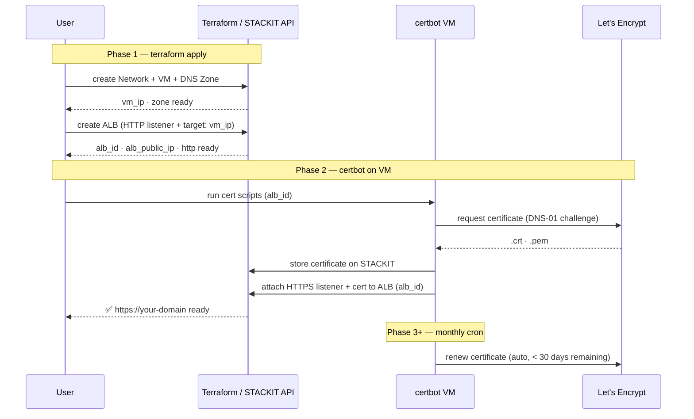

# Architecture: vm-alb-certbot-letsencrypt

## Deployment Sequence



---

# STACKIT ALB + Let's Encrypt (ACME)

## Traffic Flow

```
  Client
    │
    │ DNS lookup: alb-workshop.stackit.gg
    ▼
  STACKIT DNS
    │ resolves to ALB public IP (Terraform A-record)
    │
    │ HTTPS :443
    ▼
  STACKIT ALB  (L7, TLS termination)
    │ certificate: Let's Encrypt (managed by vm-alb-certbot-letsencrypt)
    │ HTTP routing to target pool
    │
    │ HTTP :80
    ▼
  STACKIT VM  (Debian 12, Docker Engine)
    │
    ▼
  Container: nginx:alpine  (port 80, health-check backend)
```

The ALB terminates TLS. The VM only receives plain HTTP on port 80 — no
certificate management on the backend.

---

## Three-Phase Deployment

### Phase 1 — `terraform apply`

Terraform provisions the complete infrastructure in a single apply:

| Resource                                                          | File                       |
| ----------------------------------------------------------------- | -------------------------- |
| STACKIT Folder + Project                                          | `02-resource-hierarchy.tf` |
| Network + Security Group                                          | `03-network.tf`            |
| VM (Debian 12, Docker Engine)                                     | `04-compute.tf`            |
| DNS Zone + A-record → ALB IP                                      | `05-dns.tf`                |
| Application Load Balancer (HTTP listener + target: VM private IP) | `07-alb.tf`                |

The ALB is created with an HTTP listener and target pool pointing to the VM. The HTTPS listener is added by certbot in Phase 2. `lifecycle { ignore_changes = [listeners, target_pools] }` prevents Terraform from reverting out-of-band changes.

### Phase 2 — certbot (Docker container on the VM)

```
  vm-alb-certbot-letsencrypt container
    │
    ├── 1. Run certbot DNS-01
    │       └── write _acme-challenge TXT via STACKIT DNS API
    ├── 2. Let's Encrypt validates + issues certificate
    ├── 3. Upload certificate to STACKIT Certificate Manager
    └── 4. Patch ALB HTTPS listener with new certificate ID
```

`lifecycle { ignore_changes = [listeners] }` is set on the ALB resource so
that subsequent `terraform apply` runs do not revert the certificate update.

### Phase 3 — `terraform apply`

Wire up target pool (VM private IP) to the ALB so traffic reaches the backend.

### Phase 4+ — monthly renewal

A cron job on the VM re-runs the container. It renews automatically when
fewer than 30 days of validity remain.

---

## Certificate Lifecycle (DNS-01)

```
  vm-alb-certbot-letsencrypt     STACKIT DNS API     Let's Encrypt     STACKIT Cert Mgr     ALB
        │                    │                   │                  │               │
        │── certbot DNS-01 ─►│                   │                  │               │
        │   _acme-challenge  │                   │                  │               │
        │   TXT record       │                   │                  │               │
        │                    │◄── verify TXT ────│                  │               │
        │◄────────────── certificate issued ─────│                  │               │
        │── delete TXT ─────►│                   │                  │               │
        │── upload cert ─────────────────────────────────────────►│               │
        │── PATCH listener ──────────────────────────────────────────────────────►│
```

---

## Component Responsibility

| Component                 | Provisioned by         | Purpose                                         |
| ------------------------- | ---------------------- | ----------------------------------------------- |
| STACKIT Folder + Project  | Terraform              | Resource boundary                               |
| Network + Security Group  | Terraform              | Private network, SSH + HTTP rules               |
| VM (Debian 12)            | Terraform + cloud-init | Docker host                                     |
| DNS Zone + A-record       | Terraform              | Zone apex → ALB IP                              |
| Application Load Balancer | Terraform              | HTTP listener initially, HTTPS added by certbot |
| Let's Encrypt certificate | certbot (Docker on VM) | First issuance + monthly renewal                |
