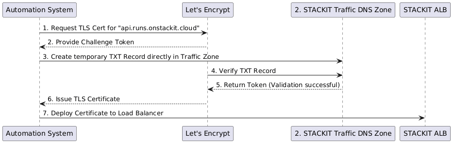
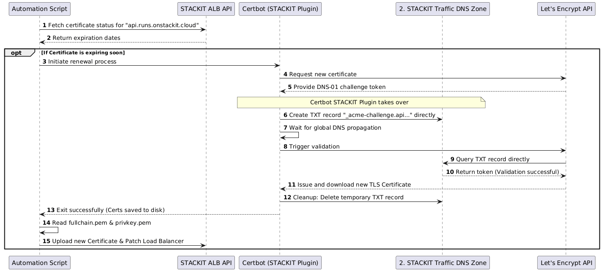
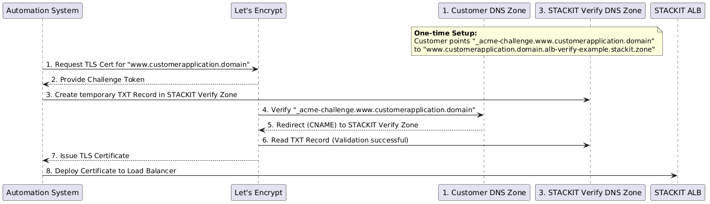
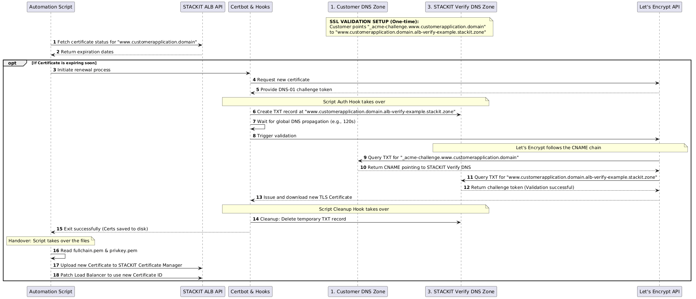

# STACKIT ALB Certificate Auto-Updater

> **DISCLAIMER:** This repository provides a Proof of Concept (PoC) and baseline implementation. It was successfully developed and tested on a Windows 10 environment using Docker Desktop. Depending on your organization's specific requirements, security policies, and special use cases, you must adapt and extend the underlying scripts (e.g., adding custom alerting, advanced error handling, or specific secret management integrations) before deploying this to a production environment.

## Overview

Securing web traffic via TLS/SSL is a standard requirement for applications exposed through a STACKIT Application Load Balancer (ALB). When using Let's Encrypt certificates, an automated renewal process is highly recommended due to their short 90-day validity period.

This solution automates the provisioning, uploading, and updating of ACME certificates without requiring inbound HTTP traffic to a validation endpoint. It leverages the **DNS-01 challenge** via the STACKIT DNS API, uploads the resulting certificates to the STACKIT Certificate Manager, and patches the Application Load Balancer to use the new certificates seamlessly.

---

## How it Works

This automation supports two different workflows for validating domain ownership via DNS, depending on where the target domain's DNS zone is hosted.

### Mode 1: Direct DNS Update (Normal Challenge)

**Use Case:** The target domain (e.g., `web.yourdomain.com`) is hosted directly within a STACKIT DNS Zone that the provided Service Account has access to.

In this mode, the script uses the official STACKIT Certbot DNS plugin to create the `_acme-challenge` TXT record directly in the domain's primary DNS zone.

**High-Level Architecture:**<br/>


<!--- https://www.plantuml.com/plantuml/png/LP5BRjim48RtEiKFRv8iBA1lm8iYZkr5KA4eQY4eicEfaKEO8jNXi83kqgDqbukLqoH2jDA3typ_u7KImv87NrLZUN7MZIO8LjiiSJ3YOi1nIaB32YP1_owvXkGYuH0iJwCeW-Qm9DxMEBRRtPVR5YsRldSM-wz7tCT0ogCjNyk95tpRt2YXpwgwm9iQzrImtfsD91DwDYUgr1BMduliHedlz2jJ4hJD4Rj2eu-CbHbTpJcaEeQIrvwTrDR7tAsgve1rcTOj6nIhtpZ-TXrXzs2yft0YjF5CeUZhgHg_CzvrZigw4oxtZkaiLxCB3RF1knex9YE4KjmOsV24zaTRpDd87ReoPCLFS66kHEjGaJBw-ESdySYFVtkLw3BR1ongLjEprliQTyIkVwrGwH7Mpwryq5OaStYAWil_2PxkDcLhAQK--wkYhiksEIKXxrKxXmvx6dsS1WgoxEfZZTkKCirDknB3o7mXUciRVAgV5xn6K80ccWutnfjWYQjh2bqU_3y0 --->

**Detailed Technical Sequence:**<br/>


## <!--- https://www.plantuml.com/plantuml/png/PPFHRzCm4CRVyrUS-i0sYKR0On_Gkcv85HKgD0p42xhQryogOnlxtAt_FRPBcsIyH4dyk_i-VsVV1aRFiTCLHhOcTbloLUNIFoMKGyCmcQU53bbP0nlXbUC9OFZtEYOtpNpnUTd0V7K7y_MoSEbz32t8yzOoN9_fjOwjCZU5Nho2FzHmnXgFkvqISFzb0x-ieS8twMjSiIA-2l1WX3ywlhXOFLJL5SotEuyjWQJadv5Zg4xRWEd7R7G6duZ54mXA3PCMCa4e7EoiXmawLVjeGcrD-YtsYckXRPIJAkzucfgSsitW6t7q1kZ5AN-AJY9Jg2gRn9OxM0mKL3XnohGGh3KL043lQv5iBOrYbLbFXfvHW_DMK0WPJK32qWwpwfz8WI4nmpraAgqNWxdRsjk3afIJdBvx3-89jIRJ4h3Tqqc-F8nb0diWdwhUbgXdS9xUU7Z0kATGs5BP-pgNUShscvyDU1BMIvZyHj7Hz29Uvt3hUW9I9OBriUzHJFz0nMKAhRPRrDbyJi5XM_8jzAiu6g_QbZmSK2jveT9Ix-jh97ySsXgg5mQcfTjbf2KZk7wyz8GGHPx5BkgRKlKwxcK8aG1DQcwVZROeou2QrMPu3FwFJ1EQw6PmJvgOWAbprkF8xd3Ne_FtyA9uO4mVuJfh1GXu80biGQgm7_YzWfNTeoPufAIn9SNHj12DJF9EssD7XeS7StJMKK8MIRDKfdRKmHjmNXtsTCnVVLb_pxwxSmx335BT6lC5NEN5EzHe1FcAZAnkqoDs-Yy0 --->

### Mode 2: ACME Challenge Delegation via CNAME

**Use Case:** Managing Let's Encrypt renewals for external domains (e.g., domains owned by end-customers). You do not have (and should not require) API credentials to directly modify their production DNS zones.

To solve this, this automation leverages **ACME Challenge Delegation via CNAME**. This allows Let's Encrypt to validate domain ownership by redirecting the challenge request to a central, isolated "Verification Zone" hosted on STACKIT. The customer only needs to create a one-time CNAME record pointing to this central zone.

**High-Level Architecture:**<br/>


<!--- https://www.plantuml.com/plantuml/png/bP9VRzCm5CNV_IcEyi9M4KlyHtsOrcLzc0W3qQX2l23Zt88rnmxsJKlvzDXXBGiWq9xo9-VUSyxFEO-i0W-T5Q9FDqQRNZb6iHZOTugDTrZj8rDNG4NajrDTJVmWOkbqsFSyQkhbLF58eXfYsaO1bzShVF2EHc6LdgRI9nAhPb6zkcgmfc0s--d0-e-1WtfHNsH5lWhXF1FybiBeyF3d632RlN5Kika8A-AXdyzc0h-YzTuuZYW-AjrHgRyeQybz9hdRxQI-5Qc-jqQFL6IRy1XN280zYd-hfBAVoktOgAHlgkijoSHTtnYMttCxGQv5pYr4HepoB66S8w5xHry7YeocNg6YmDZuWE9_eUebohGZxvhZiSJRuBUc9LI7McZy3RcZMKOqHy9V1L9COEfw7rJOetdVf0pQXnR6_Nuw-MJ4Q7Q6QbpnL1w-tHjaNe3ojlcptBmrWJJZfBfUl5wUWlrV_PFziS7pFARQkwbFrigQThH27BIc63U3FHLJHYyahc8SwCZPR78-EX9AVzOSBoKkgRT-VrUISzK-cLuegvoc8Cx9jKDdVm00 --->

**Detailed Technical Sequence:**<br/>


## <!--- https://www.plantuml.com/plantuml/png/hLLDZzem4BtdLumuj2nQejtsnc4b2AasQlQZ9KkhNYgJ3C72sAxjmD9VNzi14bZKRTLUK0ZFyzwyUMD8PGIlLZDKGI29CZIdad03dQ7zOKKC5HmckQBIT83etUCnSf8Deuz91iDq1CF7nEFiyp4eGcLcmi0Rk1LYgJqeEi5SXn1LsjAYWl7z1Bu9ZZNGVZk6lWzXJpj5HUVRumFJ5mTID6yrn3nNMsaECjCu2BWm269jEHtDPNqMeDURJ5AO3jDaFCoIXtkOnDdJ8tGVEFODNU75eDUpi8DWAIWt6ZhVIRx2VhuWZ24lCTniDc6-0n4f6SszgM5XtQMyOqiO0PtVeqB2PlsrxxEFpsGb6ORQa7n9JVZJzHmWBy0r4WJrXA1_usOmW0zeyWNardqwTqKHx45JQPWBzHfj9t0ZxTjITT41V4PJAGxuBAcgir7OaZe8XALCvX2rUAYkSPINe8NWjbE0HbranIMS6kgm2Zbk20EfH8vQUsWqSh0qTgm_AjG6BARTYKUbiHVegZqgiQO5kYJqhwxXC09hy19hUl_H6lYe7lTWhyk6Vk432eOiKNjKIqoDZHGwpTdNpEhEXIg0c7-VOCFYUlb2gF4ZAfcOMMDSkgqvafIrxLqCo_0IhjzTwOkciyQoJD6oj1sk2QE5FtAk_pJUzt-y7dF1cDXeC0k4w7vu5pipAJyOVkDNPG2VAbHRRuHFqzz77tmXFy5wq3vUDQLVA1SUknylTxsbPNfEo_yOn_ICjfDKGNTwS1XqbRlqpYlMcaahe8dM5GAngrg83MU253xIMJffByuV1JLYI7WbNyzgZHl061dQQWPNKYYoSwgExt5-MjiUFziGDasnBNITJWsQhB5mSoceNbwS4xmlSMkxTIyEmXkjFbrpob2Vt0pDPMCDShm-VA74bVtta8gkbxXrtnhUapllIHwyRLz8hHorNzyHJigTTIU57ecxF5DNR4GOuRbJBQ3I-A9uCdPty2y0 --->

## Prerequisites

To run this automation, you need the following STACKIT resources and credentials:

1. **A STACKIT Project** with an active **Application Load Balancer** (ALB).
2. **A Target DNS Zone OR a Verification DNS Zone:** Depending on the mode you choose.
3. **DNS Validator Service Account:** A STACKIT Service Account strictly scoped to manage TXT records in the relevant DNS Zone.
4. **ALB Manager Service Account:** A STACKIT Service Account with permissions for the STACKIT Certificate Manager (`POST`/`GET`/`DELETE`) and the Application Load Balancer API (`GET`/`PUT`).

_Note: You can pass these credentials either as local JSON files or as Base64 encoded environment variables (recommended for Docker/CI)._

## Repository Structure

```text
.
├── Dockerfile                  # Debian-based image definition with Certbot & STACKIT CLI
├── README.md                   # This documentation
├── keys/                       # (Local execution only) Directory for Service Account JSON keys
└── app/
    ├── Main_CertRenew_CLI.ps1  # The main orchestration script
    └── lib/
        ├── Get-StackitAlbCertStatus_CLI.ps1  # Helper: Evaluates ALB cert expiration
        ├── StackitHelper_CLI.ps1             # Helper: Handles API uploads & ALB patching
        ├── Stackit-DnsHook.ps1               # Hook: Creates TXT records in Verification Zone (Mode 2)
        └── Stackit-CleanupHook.ps1           # Hook: Deletes TXT records after validation (Mode 2)
```

## Execution Methods

The script is highly flexible. You can run it via Docker (using Base64 environment variables) or locally (using JSON files).

### Option A: Running via Docker (Recommended for CI/CD)

For Docker and CI/CD pipelines, passing JSON files via volume mounts is cumbersome and a security risk. Instead, this automation supports passing the Service Account credentials directly as **Base64 encoded strings** via environment variables. The script will safely decode them in memory during execution.

**1. Convert your `.json` Service Account keys to Base64 (single line):**

- _Linux/macOS:_ `base64 -w 0 alb-manager-sa.json`
- _PowerShell:_ `[convert]::ToBase64String([IO.File]::ReadAllBytes("alb-manager-sa.json"))`

**2. Create an `.env` file** in the root of the repository:

```env
PROJECT_ID=1b1a69ac-1482-4b44-9165-3470c0b8fb79
REGION_ID=eu01
ALB_NAME=your-alb-name
DOMAIN_WHITELIST=web.yourdomain.com,api.yourdomain.com
DAYS_WARNING=30

# Path where Certbot saves the certificates (Default: /etc/letsencrypt/live)
CERTBOT_LIVE_PATH=/etc/letsencrypt/live

# Mode Switch: set to 'true' for Delegation Mode (Mode 2), 'false' for Direct Mode (Mode 1)
USE_CHALLENGE_DELEGATION=true
VERIFY_ZONE_FQDN=alb-verify-poc-ldb-acme.stackit.zone

# Service Account Keys (Base64 encoded)
ALB_SA_KEY_B64=<BASE64_ENCODED_SA_KEY> # gitleaks:allow
DNS_SA_KEY_B64=<BASE64_ENCODED_SA_KEY> # gitleaks:allow

# Use Staging for testing to avoid Let's Encrypt rate limits!
ACME_SERVER=https://acme-staging-v02.api.letsencrypt.org/directory
# For Production, comment out the line above and use:
# ACME_SERVER=https://acme-v02.api.letsencrypt.org/directory
```

**3. Build and Run the Docker Container:**
You only need to mount the volume for Certbot to persist the certificates. You do **not** need to mount the `keys` folder!

Linux:

```bash
docker build -t stackit-alb-cert-updater .

docker run --rm -it \
  --env-file .env \
  -v "$(pwd)/letsencrypt_data:/etc/letsencrypt" \
  stackit-alb-cert-updater
```

Windows:

```powershell
docker build -t stackit-alb-cert-updater .

docker run --rm -it `
  --env-file .env `
  -v "${PWD}\letsencrypt_data:/etc/letsencrypt" `
  stackit-alb-cert-updater
```

---

### Option B: Running Locally (PowerShell)

If you are running the script locally (e.g., for testing on your workstation), you can simply pass the direct file paths to your `.json` Service Account keys.

Linux:

```powershell
./app/Main_CertRenew_CLI.ps1 `
    -ProjectId "1b1a69ac-1482-4b44-9165-3470c0b8fb79" `
    -RegionId "eu01" `
    -AlbName "your-alb-name" `
    -DomainWhitelist "www.customerapplication.domain", "www2.customerapplication.domain" `
    -UseChallengeDelegation $true `
    -VerifyZoneFQDN "alb-verify-example.stackit.zone" `
    -CertbotLive "/etc/letsencrypt/live" `
    -DNS_SAKeyPath "./keys/dns-validator-sa.json" `
    -ALB_SAKeyPath "./keys/alb-manager-sa.json" `
    -AcmeServer "https://acme-staging-v02.api.letsencrypt.org/directory"
```

Windows:

```powershell
.\app\Main_CertRenew_CLI.ps1 `
    -ProjectId "1b1a69ac-1482-4b44-9165-3470c0b8fb79" `
    -RegionId "eu01" `
    -AlbName "your-alb-name" `
    -DomainWhitelist "www.customerapplication.domain", "www2.customerapplication.domain" `
    -UseChallengeDelegation $true `
    -VerifyZoneFQDN "alb-verify-example.stackit.zone" `
    -CertbotLive "C:\Certbot\live" `
    -DNS_SAKeyPath "./keys/dns-validator-sa.json" `
    -ALB_SAKeyPath "./keys/alb-manager-sa.json" `
    -AcmeServer "https://acme-staging-v02.api.letsencrypt.org/directory"
```

## 💡 Important Note on Let's Encrypt Caching (For Testing)

When testing the renewal process, please be aware of Let's Encrypt's **Authorization Caching**. Once a domain has been successfully validated via the DNS-01 challenge, Let's Encrypt caches this successful validation for **30 days**.
If you trigger a forced renewal for the exact same domain within this window, Let's Encrypt will skip the DNS challenge entirely. Consequently, Certbot will **not** execute the DNS plugin or hook scripts (creation/deletion of the TXT record). To forcefully test the entire workflow including the DNS hooks, you must either test with a new, unvalidated subdomain or ensure you clear your local Certbot account data while using the Staging Environment.

## Limitations & Out of Scope (PoC Boundaries)

As this is a baseline Proof of Concept intended for integration into existing CI/CD environments, the following features are deliberately **not implemented** and should be managed by the surrounding automation platform:

- **CI/CD Pipeline Configurations:** This repository provides the core automation logic via Docker and PowerShell but does _not_ include ready-to-use pipeline definitions (e.g., `.gitlab-ci.yml`, GitHub Actions workflows, or Kubernetes `CronJob` manifests). The consumer must wrap this container into their own scheduling execution engine.
- **Enterprise Secret Management:** While the script supports Base64 encoded environment variables for secure pipeline injection, native API integration with external secret management solutions (e.g., HashiCorp Vault, Azure Key Vault, AWS Secrets Manager) is out of scope.
- **Orphaned Certificate Cleanup:** The script uploads new certificates but does _not_ auto-delete expired or detached certificates from the STACKIT Certificate Manager. This design choice prevents the accidental deletion of certificates that might still be bound to other resources. Housekeeping of orphaned certificates remains a separate operational process.
- **Multi-Domain (SAN) & Wildcard Certificates:** This workflow is heavily optimized for a 1:1 certificate-to-domain mapping. Grouping multiple domains under a single Subject Alternative Name (SAN) certificate or handling `*.domain.com` wildcards requires manual extensions to the underlying Certbot arguments and ALB patching logic.
- **Advanced Alerting & Notifications:** The script outputs clear status and error messages to standard `stdout`/`stderr` streams. It does not natively implement webhooks for chat platforms (e.g., MS Teams, Slack) or Email. It relies on the overarching CI/CD platform to scrape logs and trigger alerts based on the exit code (0 for success, >0 for errors).
- **Automated Rollbacks:** If the patching of the Application Load Balancer fails _after_ a new certificate has been successfully uploaded to STACKIT, the script will throw an error but will not automatically remove the newly uploaded certificate.
- **Concurrency & State Locking:** There is no native distributed state-locking mechanism. Running multiple instances of this script simultaneously against the same ALB configuration could lead to race conditions during the patching phase.

## Next Steps / Automation

For continuous operation, you should schedule this script/container to run regularly (e.g., daily). You can achieve this via:

- A standard Linux `cron` job or in windows (using the task scheduler) on a dedicated server.
- A CI/CD Pipeline schedule (e.g., GitLab CI, GitHub Actions).
- A Kubernetes `CronJob` within STACKIT Kubernetes Engine (SKE), securely mounting the service account keys as Kubernetes Secrets.
