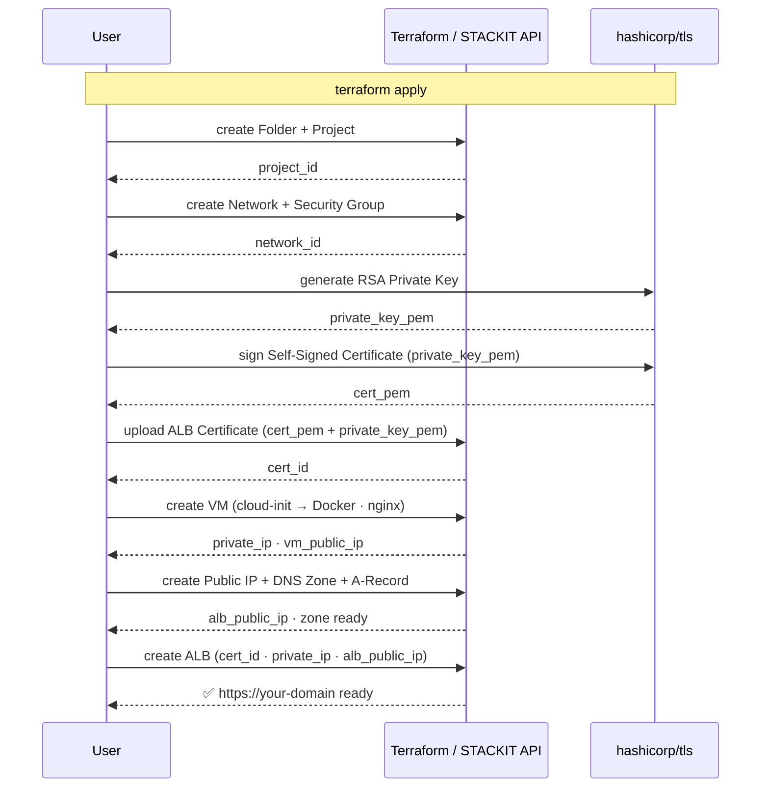

# vm-alb-self-signed-cert

Introductory showcase: a STACKIT VM with Docker nginx, an Application Load Balancer (ALB) in front of it, and a self-signed TLS certificate — fully managed by Terraform, no external tools, no ACME, no Kubernetes.

---

## Architecture



```
STACKIT Organisation
└── Folder: alb-showcase
    └── Project: vm-alb-self-signed-cert
        ├── Network: vm-alb-tls-network (10.10.0.0/24, routed)
        │   └── Security Group: vm-alb-tls-vm-sg
        │       ├── Ingress TCP 22   ← admin_cidr (SSH)
        │       ├── Ingress TCP 80   ← 0.0.0.0/0  (ALB backend traffic)
        │       └── Egress all       → 0.0.0.0/0
        ├── VM: vm-alb-tls-vm (Debian 12)
        │   └── Docker → nginx:alpine :80
        ├── DNS Zone: vm-alb-tls.stackit.gg
        │   └── A-Record → ALB Public IP
        └── ALB: vm-alb-tls-alb
            ├── Public IP (static)
            ├── Certificate: vm-alb-tls-selfsigned-cert
            ├── Listener HTTP  :80  → vm-alb-tls-pool
            └── Listener HTTPS :443 → vm-alb-tls-pool  (TLS terminated)
```

---

## Overview

| Component          | Description                                                                        |
| ------------------ | ---------------------------------------------------------------------------------- |
| Resource hierarchy | Folder + Project under an existing STACKIT organisation                            |
| Network            | Private routed network (`10.10.0.0/24`) with security groups                       |
| Compute            | Debian 12 VM with Docker Engine + nginx:alpine                                     |
| Certificate        | RSA key + self-signed X.509 cert generated by `hashicorp/tls`, uploaded to STACKIT |
| DNS                | Primary zone + A-record pointing to the ALB public IP                              |
| Load Balancer      | ALB with HTTPS :443 (TLS terminates here) and HTTP :80                             |

| In this showcase              | Not in this showcase        |
| ----------------------------- | --------------------------- |
| Self-signed TLS via Terraform | Let's Encrypt / ACME        |
| One VM + Docker nginx         | Multiple VMs / auto-scaling |
| STACKIT DNS Zone + A-Record   | Certificate renewal         |
| Fully Terraform-managed       | Kubernetes / cert-manager   |

→ For Let's Encrypt: [`vm-alb-certbot-letsencrypt/`](../vm-alb-certbot-letsencrypt/README.md)
→ For Kubernetes: [`alb-k8s/`](../alb-k8s/README.md)

---

## Prerequisites

| Tool        | Version  |
| ----------- | -------- |
| Terraform   | >= 1.5.7 |
| STACKIT CLI | latest   |
| SSH client  | —        |

### Required STACKIT permissions

| Service                           | Role     |
| --------------------------------- | -------- |
| Resource Manager (Folder/Project) | `editor` |
| Compute                           | `editor` |
| Networking                        | `editor` |
| DNS                               | `editor` |
| Application Load Balancer         | `editor` |

### Required variables

| Variable            | Description                        | Example                          |
| ------------------- | ---------------------------------- | -------------------------------- |
| `organization_id`   | STACKIT organisation container ID  | Portal → Organisation → Settings |
| `owner_email`       | Owner email for folder and project | `name@example.com`               |
| `folder_name`       | Name of the existing folder        | `alb-showcase`                   |
| `image_id`          | UUID of the Debian 12 boot image   | `stackit image list --all`       |
| `ssh_public_key`    | SSH public key string              | `ssh-ed25519 AAAA...`            |
| `admin_cidr`        | Your IP for SSH access             | `203.0.113.10/32`                |
| `dns_name`          | DNS name for the ALB               | `vm-alb-tls.stackit.gg`          |
| `dns_contact_email` | SOA contact for the DNS zone       | `name@example.com`               |

All other variables have sensible defaults — see [`01-variables.tf`](01-variables.tf).

---

## Deployment

### 1. Configure variables

```bash
cp examples/terraform.tfvars.example terraform.tfvars
# Fill in: organization_id, owner_email, image_id, ssh_public_key, admin_cidr, dns_name
```

Find your egress IP for `admin_cidr`:

```bash
curl -s https://ifconfig.schwarz
```

Find available Debian 12 image UUIDs:

```bash
stackit image list --all --project-id <project-id>
```

### 2. Configure remote state

```bash
cp examples/backend.conf.example backend.conf
# Fill in: bucket, key, access_key, secret_key
```

### 3. Deploy

```bash
terraform init -backend-config=backend.conf
terraform plan
terraform apply
```

Duration: ~5–8 minutes. Expected resources: ~15.

### 4. Outputs

```bash
terraform output
```

---

## Validation

```bash
# HTTPS — -k skips the self-signed cert warning
curl -k https://vm-alb-tls.stackit.gg

# HTTP
curl http://vm-alb-tls.stackit.gg

# Inspect TLS certificate
openssl s_client -connect vm-alb-tls.stackit.gg:443 </dev/null 2>/dev/null \
  | openssl x509 -noout -subject -issuer -dates

# SSH to the VM
ssh debian@$(terraform output -raw vm_public_ip)
docker ps
docker logs nginx
```

---

## File Structure

```
vm-alb-self-signed-cert/
├── .terraform-version          # Terraform version pin (v1.5.7)
├── .gitignore
├── 00-backend.tf               # S3 remote state (STACKIT Object Storage)
├── 00-provider.tf              # stackitcloud/stackit + hashicorp/tls
├── 01-variables.tf             # All variables with descriptions and defaults
├── 02-resource-hierarchy.tf    # locals, folder resource, project
├── 03-network.tf               # Network, security group, rules
├── 04-compute.tf               # SSH key pair, NIC, VM (Docker nginx)
├── 05-certificate.tf           # tls_private_key, tls_self_signed_cert, stackit_alb_certificate
├── 05-dns.tf                   # DNS zone + A-record
├── 06-alb.tf                   # Public IP, Application Load Balancer
├── 07-outputs.tf               # All outputs (IP, URLs, SSH, cert_id, curl)
├── templates/
│   └── cloud-init.yaml.tpl     # Docker Engine install + nginx:alpine container
├── examples/
│   ├── terraform.tfvars.example
│   └── backend.conf.example
├── docs/
│   └── architecture.md         # Deployment sequence diagram + component overview
└── keys/                       # SA key JSON — gitignored
```

---

## Security

| File               | Git status | Contains                   |
| ------------------ | ---------- | -------------------------- |
| `terraform.tfvars` | gitignored | SSH key, sensitive config  |
| `backend.conf`     | gitignored | Object Storage access keys |
| `keys/`            | gitignored | Service account JSON key   |

- SSH access is restricted to `admin_cidr` — never use `0.0.0.0/0`
- The TLS private key is stored in Terraform state — acceptable for a showcase, use KMS/Vault for production

---

## Cleanup

```bash
terraform destroy
```

Removes all resources: ALB, VM, network, certificate, DNS zone, public IP, project.
The parent folder is not destroyed (it pre-exists and was imported into state).

---

## Troubleshooting

| Problem                         | Cause                           | Fix                                              |
| ------------------------------- | ------------------------------- | ------------------------------------------------ |
| `curl: (7) Failed to connect`   | ALB not ready yet               | Wait 1–2 min                                     |
| `curl: (35) SSL error`          | Self-signed cert                | Use `-k` flag                                    |
| nginx not responding            | Docker image pull still running | Wait 3–5 min, check `docker ps` on VM            |
| DNS not resolving               | Zone not yet propagated         | Run `dig vm-alb-tls.stackit.gg` and wait         |
| Provider error on folder labels | Existing labels after import    | `lifecycle { ignore_changes = [labels] }` is set |

---

## References

- [Full architecture details](docs/architecture.md)
- [STACKIT Terraform Provider](https://registry.terraform.io/providers/stackitcloud/stackit/latest/docs)
- [STACKIT CLI](https://github.com/stackitcloud/stackit-cli)
- [STACKIT Developer Documentation](https://docs.stackit.cloud)
- [hashicorp/tls Provider](https://registry.terraform.io/providers/hashicorp/tls/latest/docs)
