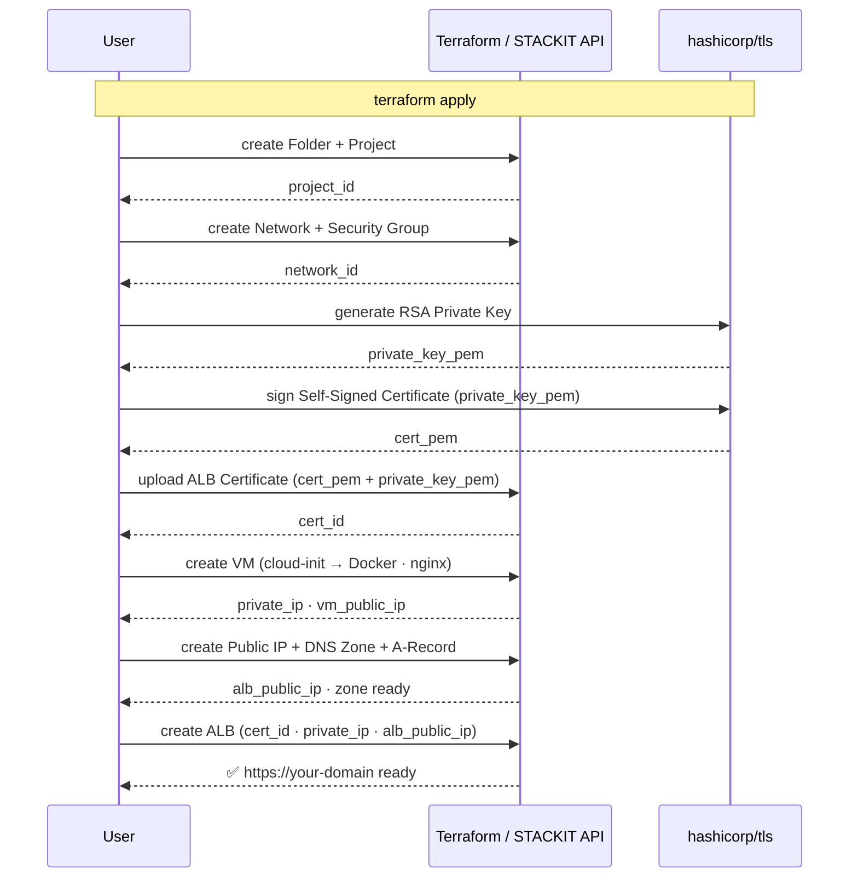

# Architecture: vm-alb-self-signed-cert

## Deployment Sequence



---

# VM + ALB + Self-Signed TLS

## Traffic Flow

```
  Client
    │
    │ DNS lookup: vm-alb-tls.stackit.gg
    ▼
  STACKIT DNS
    │ resolves to ALB public IP (Terraform A-record)
    │
    │ HTTPS :443
    ▼
  STACKIT ALB  (L7, TLS termination)
    │ certificate: self-signed (hashicorp/tls, managed by Terraform)
    │ HTTP routing to target pool
    │
    │ HTTP :80
    ▼
  STACKIT VM  (Debian 12, Docker Engine)
    │
    ▼
  Container: nginx:alpine  (port 80)
```

The ALB terminates TLS. The VM only receives plain HTTP on port 80 — no
certificate management on the backend.

---

## Component Responsibility

| Component                 | File                       | Purpose                           |
| ------------------------- | -------------------------- | --------------------------------- |
| STACKIT Folder + Project  | `02-resource-hierarchy.tf` | Resource boundary                 |
| Network + Security Group  | `03-network.tf`            | Private network, SSH + HTTP rules |
| VM (Debian 12)            | `04-compute.tf`            | Docker host                       |
| TLS Private Key           | `05-certificate.tf`        | RSA key pair (hashicorp/tls)      |
| Self-Signed Certificate   | `05-certificate.tf`        | X.509 cert (hashicorp/tls)        |
| ALB Certificate resource  | `05-certificate.tf`        | Uploads cert to STACKIT           |
| DNS Zone + A-record       | `05-dns.tf`                | Zone apex → ALB public IP         |
| Application Load Balancer | `06-alb.tf`                | L7 TLS termination + HTTP routing |

---

## Certificate Flow

```
  hashicorp/tls provider           STACKIT
  ─────────────────────            ───────
  tls_private_key       ─ PEM ─►  stackit_alb_certificate  ─ cert_id ─►  stackit_application_load_balancer
  tls_self_signed_cert  ─ PEM ─►  (certificate store)                      (HTTPS listener)
```

All steps happen in a single `terraform apply`. No scripts or manual API calls required.

---

## Resource Hierarchy

```
STACKIT Organisation
└── Folder: alb-showcase  (imported via terraform import)
    └── Project: vm-alb-self-signed-cert  (created by Terraform)
        ├── Network: vm-alb-tls-net (10.10.0.0/24, routed)
        │   └── Security Group: vm-alb-tls-vm-sg
        │       ├── Ingress TCP 22  ← admin_cidr only
        │       ├── Ingress TCP 80  ← 0.0.0.0/0  (ALB backend traffic)
        │       └── Egress all      → 0.0.0.0/0
        ├── VM: vm-alb-tls-vm (Debian 12, Docker Engine)
        ├── Certificate: vm-alb-tls-selfsigned-cert (self-signed)
        ├── DNS Zone: vm-alb-tls.stackit.gg (primary)
        └── ALB: vm-alb-tls-alb
            ├── Public IP (dedicated, wired to DNS A-record by Terraform)
            ├── Listener HTTP  :80  → VM:80
            └── Listener HTTPS :443 → VM:80  (TLS terminated at ALB)
```

---

## Security Notes

| Concern                        | Status                                                      |
| ------------------------------ | ----------------------------------------------------------- |
| Private key in Terraform state | Yes — acceptable for showcase/dev                           |
| Certificate trust              | Self-signed — browsers will warn; use `curl -k` for testing |
| SSH access                     | Restricted to `admin_cidr` — never use `0.0.0.0/0`          |
| Production recommendation      | Use `stackit-acme-alb` for Let's Encrypt certs              |
