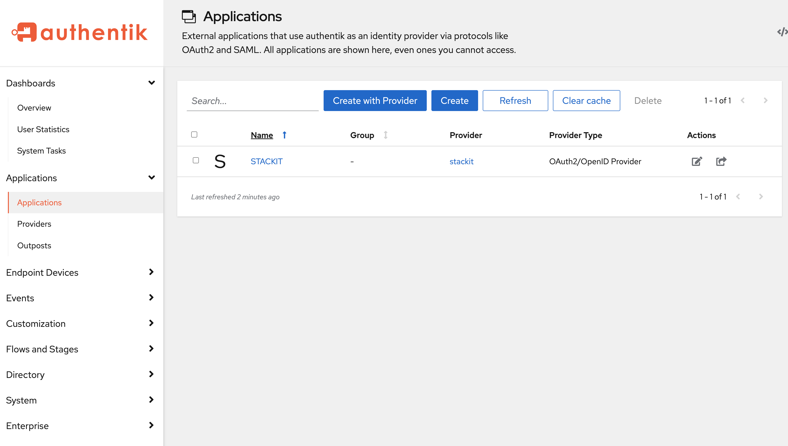
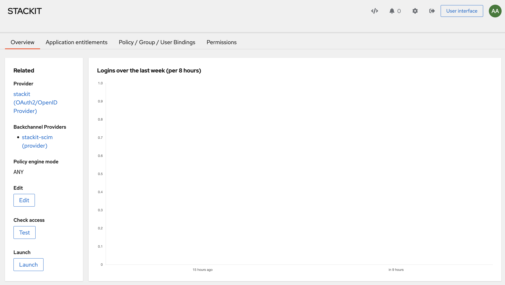
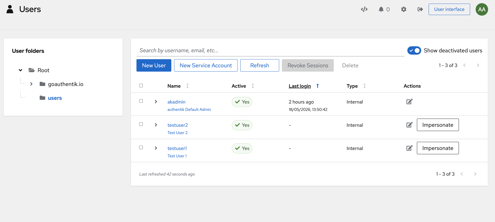
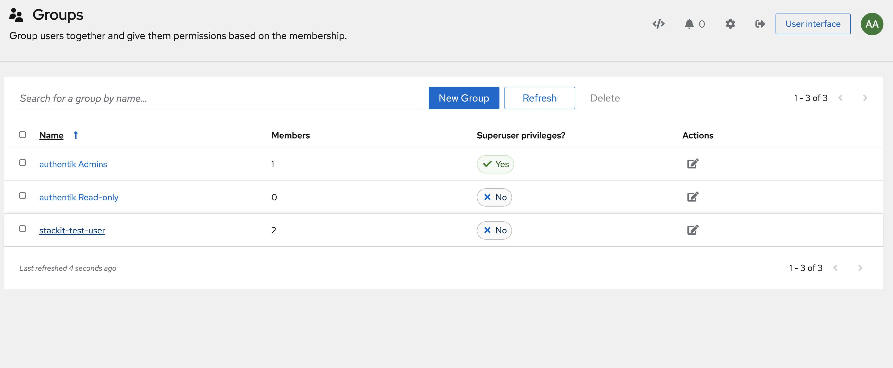
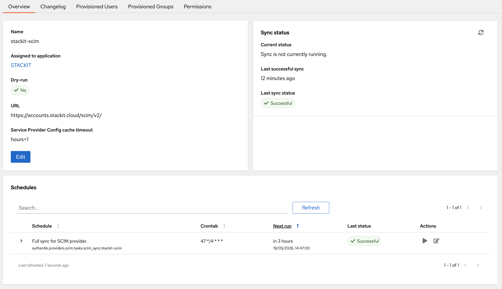
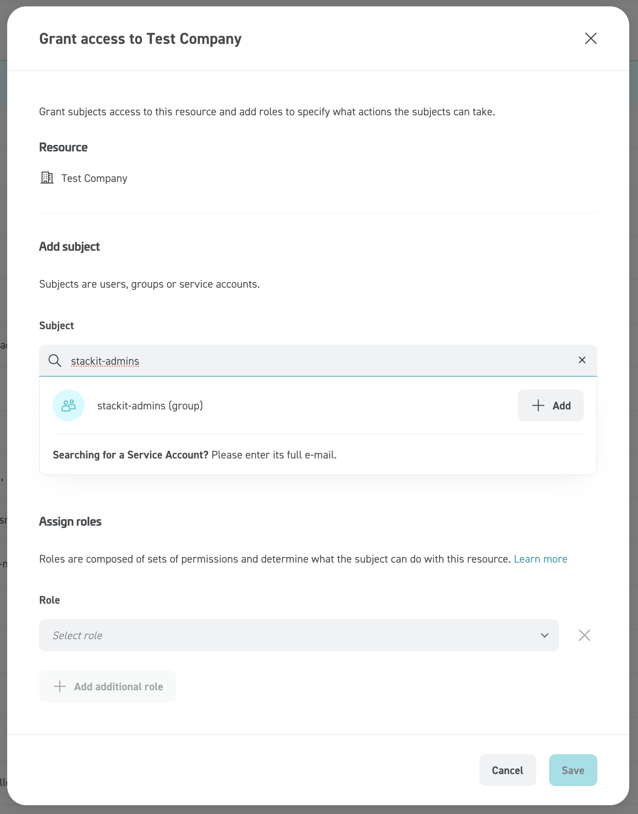

# STACKIT IAM-SCIM Integration with Authentik

This repository provides an automated setup for **Authentik** on STACKIT SKE, pre-configured as an Identity Provider (IdP) for STACKIT with both **OIDC** and **SCIM** support.

## Integration Details

### OAuth2 / OIDC

Authentik acts as the OIDC issuer. The provider is configured with the following:

- **Client ID**: `stackit-client`
- **Scopes**: `openid`, `email`, `profile`
- **Custom Claims**: Maps `given_name`, `family_name`, and `preferred_username` from Authentik user attributes.

### SCIM Provisioning

Automated user and group synchronization to STACKIT:

- **Endpoint**: `https://accounts.stackit.cloud/scim/v2/`
- **Authentication**: Uses a long-lived token (required for Authentik Community Edition).
- **Mapping**: Synchronizes both Users and Groups (e.g., `stackit-admins`).

---

## ⚠️ STACKIT Integration Process

**Self-service provisioning for configuring external Identity Providers is currently a Work In Progress.** Until this is released, you must request the integration by opening a STACKIT support ticket.

### What to supply in your ticket:

Please open a support ticket with STACKIT containing the following details:

**General Information**

- **Federation type:** OpenID Connect (OIDC)
- **Reason for integration:** Brief explanation (e.g., "Enable SSO and SCIM for enterprise users via Authentik")
- **Email domains:** All email domains your employees use for login (e.g., `@example.com` and `@foobar.com`)

**OIDC-Specific Information**

- **Issuer:** The Issuer identifier URL for your Authentik instance (e.g., `https://authentik.example.com/`)
- **Client ID:** The ID assigned to the application (`stackit-client`)
- **Client Secret:** The secret key associated with your Client ID _(Note: Provide this securely!)_
- **Scopes:** `openid`, `profile`, `email`
- **Display name:** Internal name for this federation (e.g., `my_company_authentik`)
- **Claims mapping:** \* Unique user ID -> `sub`
  - Email address -> `email`
  - Preferred name -> `preferred_username`
  - First name -> `given_name`
  - Last name -> `family_name`

### What you will receive in return:

Once STACKIT support processes your ticket, they will configure the trust relationship on their end. You will receive:

1. **Confirmation of Federation:** Your Authentik instance will officially be trusted by the STACKIT login portal.
2. **SCIM Credentials:** You will be provided with the required OAuth credentials to generate the necessary Bearer tokens so Authentik can communicate with the STACKIT SCIM API.

---

## Testing the SCIM Integration

### Scenario 1: User Sync

1. **Create a User**: In the Authentik UI (_Directory -> Users_), create a new test user.
2. **Assign to Application**: Ensure the user is assigned to the `STACKIT` application.
3. **Verify**: Log in to the STACKIT Portal. If the user doesn't appear immediately, go to _Applications -> STACKIT -> Backchannel Providers_ and click **Sync Now**.

### Scenario 2: Group & Role Mapping (RBAC)

1. **Create/Assign Group**: Add your user to the `stackit-admins` group in Authentik.
2. **Map to STACKIT Role**: In the STACKIT Org settings, map this group to the `Owner` or `Admin` role.
3. **Verify Access**:
   - Log in to the STACKIT Portal. The user should have the assigned organization-level permissions.
   - **Remove Group**: Remove the user from the group in Authentik. After sync, the user's permissions in the STACKIT Org will be revoked.

---

## Visual Verification

### 1. Dashboard/Application Overview

### 2. User & Group Management

### 3. SCIM Sync

### 4. Group on STACKIT Side

---

## References & Documentation

- [Generic OIDC 2.0 Federation Guide](https://docs.stackit.cloud/platform/access-and-identity/stackit-idp/how-tos/generic-oidc-2_0-federation-guide/)
- [SCIM Endpoint STACKIT IdP Guide](https://docs.stackit.cloud/platform/access-and-identity/stackit-idp/how-tos/scim-endpoint/)
