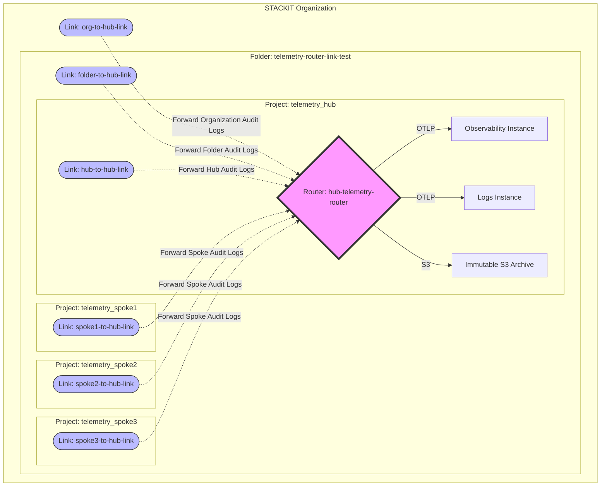

# Telemetry Router: Hub-and-Spoke Setup

This example demonstrates how to use the **STACKIT Telemetry Router** to centralize observability data across multiple projects, folders, and even the entire organization.

> ⚠️⚠️⚠️\
> **1. A Telemetry Router DOES NOT replace a Telemetry Link.**
> Creating a Router in a project only provides the ingestion endpoint. To actually forward logs from that same project (or any other project) to the router, you **MUST** create an explicit `stackit_telemetrylink`. Every project in your hierarchy requires its own link to participate in the telemetry routing.
>
> **2. Current Scope: Audit Logs Only.**
> In its current state, the Telemetry Router supports **Audit Logs** only. Ingesting logs from other services (e.g., managed databases like Postgres or MongoDB) is currently Work-in-Progress (WIP). This example will be updated as soon as these features become available.

## Architecture Overview



## What this setup does

1.  **Centralizes Telemetry**: Creates a **Hub Project** that hosts a central Telemetry Router instance.
2.  **Connects the Hierarchy**: Uses **Telemetry Links** at three different levels (Organization, Folder, Project).
3.  **Broadcasts & Filters Data**:
    - **Observability Destination**: All data is sent to a `stackit_observability_instance`.
    - **Logs Destination (Filtered)**: Only logs from the **`service-account`** service are forwarded to the `stackit_logs_instance`. This demonstrates how to filter for specific high-value audit trails (like IAM actions).
    - **Immutable S3 Archive (Compliance)**: All data is archived in a **WORM-protected STACKIT Object Storage (S3)** bucket. This meets organizational requirements for tamper-proof, long-term storage of audit logs where data cannot be edited or deleted.
4.  **Generates Continuous Logs**: Demonstrates the setup with a **Log Generator** that rotates credentials every minute to trigger continuous Audit Logs.
5.  **Handles Authentication**: Manages Router Access Tokens and Backend Credentials (OTLP/S3).

## Compliance & Security (WORM Protection)

This example implements a "Write Once Read Many" (WORM) strategy for log archiving:

- **Compliance Lock**: Enabled at the project level.
- **Object Lock**: Enabled on the S3 bucket (`042-s3-bucket.tf`).
- **Immutable Destination**: The router destination `immutable-audit-archive` ensures every log entry received is stored in this protected bucket, satisfying legal and internal auditing requirements.

## Resource Architecture Summary

- **Organization Level**: 1 Link for org-wide audit logs.
- **Folder Level**: 1 Link for folder-wide audit logs.
- **Project Level**:
  - **Hub Project**: 1 Router + 1 Link (mandatory to ingest hub-specific logs).
  - **Spoke Projects**: 3 Projects, each with its own individual Link.

## How to use

1.  Set your variables in a `terraform.tfvars` file (Org ID, Owner Email, etc.).
2.  Initialize and apply:
    ```bash
    terraform init
    terraform apply
    ```
3.  Check the **outputs** for the Router URI and all Link IDs to verify the connection.

## Post-Deployment: Monitoring & Retrieval

Auxiliary scripts are located in the `scripts/` directory.

### Monitoring S3 Archive

To check how many log objects (compressed) are currently archived in S3:

```bash
./scripts/count-s3-items.sh
```

### Log Retrieval, Extraction & Beautification

To download, automatically unzip, and beautify all archived logs from S3:

```bash
./scripts/download-s3-logs.sh
```
