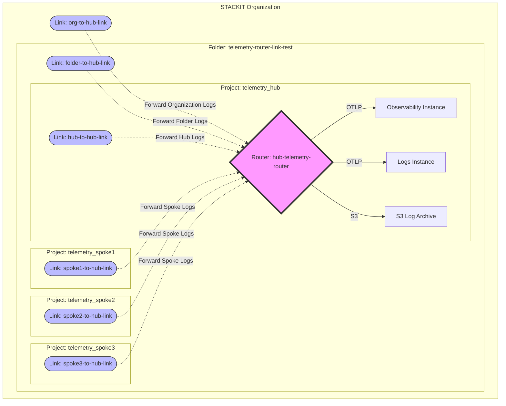

# Telemetry Router: Hub-and-Spoke Setup

This example demonstrates how to use the **STACKIT Telemetry Router** to centralize observability data across multiple projects, folders, and even the entire organization.

> ⚠️⚠️⚠️ **A Telemetry Router DOES NOT replace a Telemetry Link.** ⚠️⚠️⚠️\
> Creating a Router in a project only provides the ingestion endpoint. To actually forward logs from that same project (or any other project) to the router, you **MUST** create an explicit `stackit_telemetrylink`. Every project in your hierarchy requires its own link to participate in the telemetry routing.

## Architecture Overview



## What this setup does

1.  **Centralizes Telemetry**: Creates a **Hub Project** that hosts a central Telemetry Router instance.
2.  **Connects the Hierarchy**: Uses **Telemetry Links** at three different levels:
    - **Organization Level**: Forwards organization-wide audit logs to the central router.
    - **Folder Level**: Ensures all telemetry from a specific folder and its sub-projects is routed to the Hub.
    - **Project Level**: Connects individual "Spoke" projects and the **Hub Project itself** to the Router.
3.  **Broadcasts & Filters Data**:
    - **Observability Destination**: All data is sent to a `stackit_observability_instance`.
    - **Logs Destination (Filtered)**: Only logs from the **`service-account`** service are forwarded to the `stackit_logs_instance`. This demonstrates how to filter for specific high-value audit trails (like IAM actions).
    - **S3 Archiving**: All data is also archived in a **STACKIT Object Storage (S3)** bucket for long-term retention.
4.  **Generates Continuous Logs**: To demonstrate the setup, this example includes a **Log Generator** (`070-log-generator.tf`). It creates S3 credentials in every project and rotates them **every minute**. These frequent administrative actions trigger continuous Audit Logs, which you should see appearing in your Observability and Logs instances.
5.  **Handles Authentication**:
    - Uses a **Router Access Token** for the links to connect.
    - Uses **Credentials/Access Tokens** for the router to push data to the backend Observability and Logs instances via OTLP.

## Resource Architecture

- **1 Organization**: Linked via an Org-level Telemetry Link.
- **1 Folder**: Contains all projects and is linked via a Folder-level Link.
- **1 Hub Project**: Contains the Router, Observability, Logs, and S3 Bucket instances. **⚠️⚠️⚠️ Crucially, it is also linked to its own Router.⚠️⚠️⚠️**
- **3 Spoke Projects**: Connected to the Hub via individual Project-level Links.

## How to use

1.  Set your variables in a `terraform.tfvars` file (Org ID, Owner Email, etc.).
2.  Initialize and apply:
    ```bash
    terraform init
    terraform apply
    ```
3.  Check the **outputs** for the Router URI and all Link IDs (Org, Folder, and Projects) to verify the connection.

## Post-Deployment: Monitoring & Retrieval

To avoid external dependencies during deployment, all scripts are located in the `scripts/` directory and should be run manually from within this folder.

### Monitoring S3 Archive

To check how many log objects are currently archived in S3:

```bash
./scripts/count-s3-items.sh
```

This script retrieves the necessary credentials from the Terraform state and uses the AWS CLI to count the objects.

### Log Retrieval, Extraction & Beautification

To download, automatically unzip, and beautify all archived logs from S3:

```bash
./scripts/download-s3-logs.sh
```

The script will:

1. Download all logs from S3.
2. Unzip all `.gz` files.
3. Format all JSON files for better readability (using `jq`).

The logs will be saved in the `scripts/downloads/` directory (which is ignored by Git).

---

_Note: This service is currently in beta. `enable_beta_resources = true` is required in the provider configuration._
