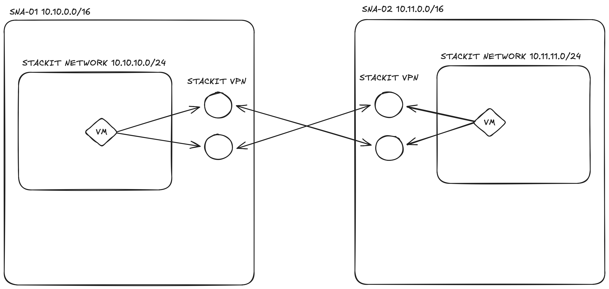

# STACKIT-to-STACKIT VPN Gateway

This example leverages the STACKIT VPN service to establish a secure, Highly Available (HA) connection between two separate STACKIT Network Areas (SNAs).

The connection utilizes **BGP (Border Gateway Protocol)** to automatically propagate and learn routing information between the two networks.

> **Note:** Currently, native SNA peering is not available in STACKIT. Therefore, provisioning a VPN connection is the required method to interconnect two SNAs. This will change in the future once native SNA peering is released.



## How to Test the Connection

Once the deployment is complete, you can verify the VPN tunnel using the provisioned debug machines:

1. **SSH** into the first debug machine using its public IP (`vpn01_public_ip`).
2. **Ping** the private IP of the second debug machine (`vpn02_private_ip`) across the tunnel.

```bash
# Example test command once connected to the vpn01 machine via SSH
ping <vpn02_private_ip>
```
